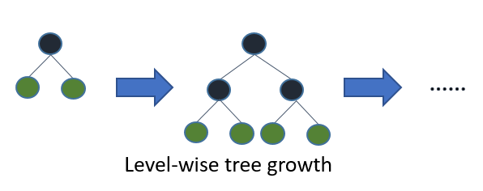
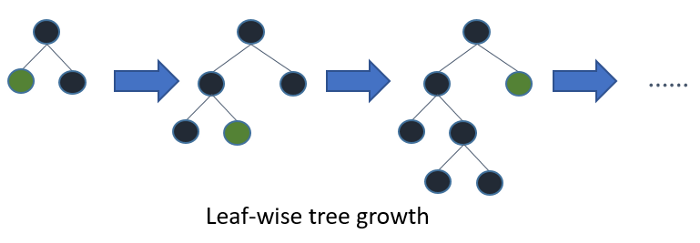

# cebd1260: Predicting Destination Booking for New Airbnb Users

| Name | Date |
|:-------|:---------------|
|Donald Lafrance| November 24, 2020|

### Resources

- Pipeline files: `airbnb/`
- Figures: `plots/`

-----

## Introduction

Airbnb is the world's leader for the online marketplace of short-term hospitality bookings, whether it's an apartment, hotel or other tourism lodgins and experiences. It's platform allows users to connect directly with hosts and facilitate holiday experiences. Airbnb does not own the listed property, but does make revenue from booking fees and other service fees associated to the transaction between guests and hosts. This exchange does include a great number of data points for each user, thus an opportunity for predictive modeling based on each user's actions and identity.

This machine learning use case aims to predict a new user's first booking destination. Training users booking data can provide insight into predicting a new user's preference towards their first booking travel destination. Facilitating this first booking through machine learning has the potential to increase the likelihood of a booking's occurence, and therefore increasing revenues.

After exploring past user data, the first step of the pipeline was to perform data pre-processing to remove/fill NAs and encode fields for the next step of the pipeline. Then, new features were created (date fields) and aggregated from the `sessions` table and merged to the `main` table to increase the total count of features. Finally, a LightGBM framework was used for modeling the data over 5 folds for multi-class classification.

The models generated an average logloss of **1.34**, while the top features of importance were:
1) _age_
2) _first_booking_week_
3) _first_active_hour_
4) _first_booking_day_
5) _diff_booking_first_active_

It is interesting that datetime features along with the user's age were quite important in the model prediction of the country destination of the booking.

## Data exploration

## Pipeline

### Data pre-processing

**Missing data**
- `country_destination`: a large number of the target's data points were actually listed as `NDF` or not defined. Since the goal of the model is to predict the destination, rows with non-defined countries were removed.
- `age`: missing data were replaced by the median age.
- `first_affiliate_tracked`: NAs were replaced by a `unknown`, `action_type`
- `sessions_df`: in this table, missing values in `action`, `action_type` and `action_detail` were replaced by `-unknown-`. Also, rows with missing `user_id` were removed. Once this table was merged to the main table, all the remaining missing values were replaced by the median.

**Outliers**
- `age`: outliers were identified in the age fields, such as users above 90 and below 18. It's very unlike that Airbnb users would exist beyond those limits, therefore they were replaced by the median age.
- `secs_elapsed`: any data points above the 90th quantile were removed 

### Feature engineering

- Datetime fields: features from datetime fieds were created such as year, month, week, day, weekday and hour. Two additional features were also created to account for the difference between the first booking date, the account creation date and the first active date. It was an assumption that these features would be important consideing an account creation is necessary to make a booking.
- Age groups: an additional feature for age groups was created.
- Encoding: categorical fields were one-hote encoded, with the exception of `age_group` and `country_destination` which were label encoded.
- Sessions data aggregation: New fields were created from aggregating fields by `user_id` from the sessions table. These fields were then merged to the main table.

```python

'action': ['count','nunique'],
'action_type': ['nunique'],
'action_detail': ['nunique'],
'device_type': ['nunique'],
'secs_elapsed': ['sum', 'mean','median', 'min', 'max']

```

### Model

Although XGBOOST modeling yielded a similar results, the Light GBM algorith was chosen for its:
- Faster processing speed
- Lower memory usage
- Slightly better results


Light GBM is a boosting model based on a decision tree algorithm. Instead in splitting the tree level-wise like XGBOOST:



Light GBM will grow the tree on the same leaf, therefore splitting the tree leaf-wise, which can reduce loss to a greater extent than XGBOOST:



Overfitting can occur with Light GBM as it converges quickly, and this can be happen if the parameters aren't set correctly. One rule of thumb is to ensure that `num_leaves` < `2^max_depth` to avoid overfitting the model.

### Methodologies

The data was split in training and test sets of 90% and 10%, respectively. K-fold cross-validation was used to evaluate the model before applying it to the test set. Approximately 5 folds were applied.

As the goal was to classify destinations, the light GBM model was adjusted for multi-classification, including the number of classes (11). The model was evaluated on the logloss result.

Furher parameter tuning of the model was achieved through Bbyesian optimatization, in which certain parameter tweaking yielded marginally better results.

### Results


### References

- Data set: https://www.kaggle.com/stefanoleone992/fifa-20-complete-player-dataset
- Logistic regression package: https://scikitlearn.org/stable/modules/generated/sklearn.linear_model.LogisticRegression.html

-------
